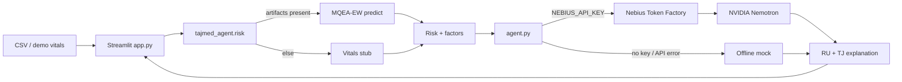

# TajMed Agent

**Nebius × NVIDIA Global AI Hackathon** · Track: **Best Apps and Agents** · Deadline: **30 Oct 2026**

Russian + Tajik medical **decision-support** agent (not a diagnostic device).  
Author: **Muhammad** (Dushanbe). License: **MIT**.  
Repo: https://github.com/Fopen1/tajmed-agent

> **Disclaimer / Дисклеймер (read first)**  
> This is a **hackathon prototype for clinical decision support only**. It is **not** a medical device, does **not** diagnose, prescribe, or replace a clinician, and has **not** been clinically validated for patients in Tajikistan. LLM text can be wrong. A licensed clinician must make all decisions.  
> Это **прототип поддержки решений** для хакатона. Это **не** медицинское изделие, **не** ставит диагноз и **не** назначает лечение. Клиническая валидация на пациентах Таджикистана **не** проводилась. Ответы LLM могут быть неточны. Решение принимает только врач.

See also: **[SUBMISSION.md](SUBMISSION.md)** (EN+RU hackathon checklist).

---

## Concept / Концепция

| EN | RU |
|----|----|
| Ingest patient vitals/labs (CSV or demo). | Принимает витальные/лабораторные данные (CSV или демо). |
| Score early-warning risk via existing **MQEA-EW** model when available (no retraining). | Оценка риска через существующую модель **MQEA-EW** (если доступна), без переобучения. |
| Fallback: transparent vitals heuristic with a clear TODO. | Запасной вариант: простая эвристика по витальным + TODO. |
| **NVIDIA Nemotron** via **Nebius Token Factory** explains risk in **Russian** and **Tajik**, non-diagnostic language. | **NVIDIA Nemotron** через **Nebius Token Factory** поясняет риск на **русском** и **таджикском**. |

---

## Architecture



ASCII (if Mermaid does not render):

```
  CSV/demo ──► Streamlit UI ──► risk.py ──┬── MQEA-EW (if /workspace/mqea_ew)
                                          └── vitals stub
                     │
                     ▼
               agent.py ──► Nebius Token Factory ──► NVIDIA Nemotron ──► RU/TJ text
                     │              (or offline mock)
                     └──────────────────────────────────────────────────────┘
```

**MQEA-EW** is a **separate** early-warning project (sibling checkout, typically `/workspace/mqea_ew` on the box). TajMed Agent only **imports** its predict API when artifacts exist; it never retrains. Set `MQEA_EW_ROOT` if your tree lives elsewhere.

---

## How Nebius / Nemotron is used

1. Risk engine returns `latest_risk`, `alert`, and top contributing factors.
2. `agent.py` builds a **structured prompt** (score + factors only — never invents diagnoses).
3. Chat Completions call goes to Nebius Token Factory (OpenAI-compatible):

```python
from openai import OpenAI
client = OpenAI(
    api_key=os.environ["NEBIUS_API_KEY"],
    base_url=os.environ.get("NEBIUS_BASE_URL", "https://api.tokenfactory.nebius.com/v1/"),
)
client.chat.completions.create(
    model=os.environ.get("NEBIUS_MODEL", "nvidia/Nemotron-3_5-Lightning"),
    messages=[...],
)
```

**Correct defaults (verified against Token Factory docs / catalog, Oct 2026):**

| Setting | Value |
|---------|--------|
| Base URL | `https://api.tokenfactory.nebius.com/v1/` |
| Default model | `nvidia/Nemotron-3_5-Lightning` |
| Alt. Nemotron IDs | `nvidia/NVIDIA-Nemotron-3-Nano-30B-A3B`, `nvidia/nemotron-3-super-120b-a12b`, `nvidia/Nemotron-3-Ultra-550b-a55b` |

Catalog: https://tokenfactory.nebius.com/model-catalog.md · API intro: https://docs.tokenfactory.nebius.com/api-reference/introduction

Without `NEBIUS_API_KEY` (or on auth / bad-model / network errors), the agent returns a **deterministic mock** explanation so the demo and `smoke_test` stay runnable offline.

---

## Setup / Установка

```bash
cd tajmed-agent   # or /workspace/tajmed-agent on the box
python -m venv .venv && source .venv/bin/activate   # Windows: .venv\Scripts\activate
pip install -r requirements.txt
cp .env.example .env
# Edit .env: set NEBIUS_API_KEY from https://tokenfactory.nebius.com/ → API keys
streamlit run app.py
```

**API key + promo (hackathon):**

1. Create key in Token Factory → **API keys** → Create (save once; cannot reopen).
2. Apply promo **`NEBIUS-DEVPOST-GLOBAL26`**: balance → **Top up** → **With promo code** ([resources](https://nebiusglobalaihackathon.devpost.com/resources)).
3. Never commit `.env` (gitignored).

Smoke test (mock always; live call only if key present):

```bash
python scripts/smoke_test.py
```

---

## Screenshots / Скриншоты

Place PNGs under `screenshots/` (folder optional) and link them here before Devpost submit:

| Placeholder | Suggested capture |
|-------------|-------------------|
| `screenshots/01-overview.png` | Main UI with disclaimer + risk metrics |
| `screenshots/02-chart.png` | Risk-over-time chart + alert banner |
| `screenshots/03-explain-ru-tj.png` | Nemotron RU / TJ explanation tabs |

_No screenshots checked in yet — add before submission._

---

## Project layout

```
tajmed-agent/
  app.py                 # Streamlit UI (RU): CSV/demo, chart, alert, RU/TJ tabs
  agent.py               # Nemotron prompt + Nebius client (mock / graceful errors)
  tajmed_agent/
    config.py            # env defaults + known Nemotron IDs
    risk.py              # MQEA-EW adapter or vitals stub
  demo_data/patient_demo.csv
  scripts/smoke_test.py
  SUBMISSION.md          # Hackathon checklist (EN+RU)
  .env.example
  requirements.txt
  LICENSE                # MIT
  README.md
```

Do **not** commit secrets (`.env` is gitignored).

---

## Hackathon notes

- **Track:** Best Apps and Agents  
- **Stack:** Streamlit + MQEA-EW (optional) + NVIDIA Nemotron on Nebius Token Factory  
- **Languages:** Russian UI; explainer Russian + Tajik (Cyrillic)  
- **Differentiator:** Bilingual bedside explanations grounded in model factors; offline-friendly mock path  
- **License:** MIT  
- **Submission checklist:** [SUBMISSION.md](SUBMISSION.md) · Devpost: https://nebiusglobalaihackathon.devpost.com/
